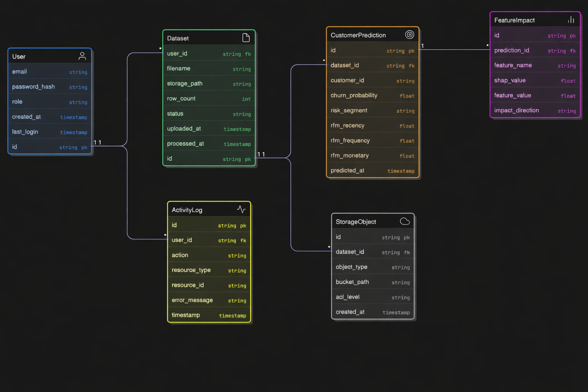

# Feature Breakdown
https://docs.google.com/document/d/1jHJci9PdH8JLYhHAI7OY6XUb2nT7jFg-YwZUTfKgjhY/edit?usp=sharing

# HLD

# LLD 

# Data Flow Diagram

# ERD 

# API Contracts

# Deployment Plan

