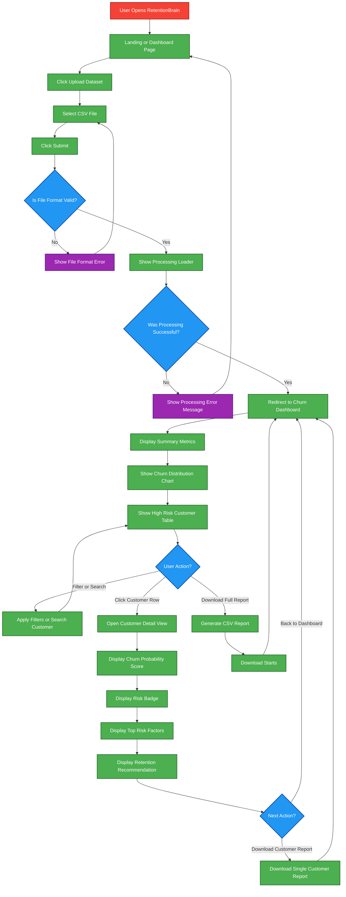

# RetentionBrain – User Flow Diagram

This document describes the consumer journey for the RetentionBrain application.

The flow represents how a user interacts with the system from dataset upload to churn analysis and report download.

---

